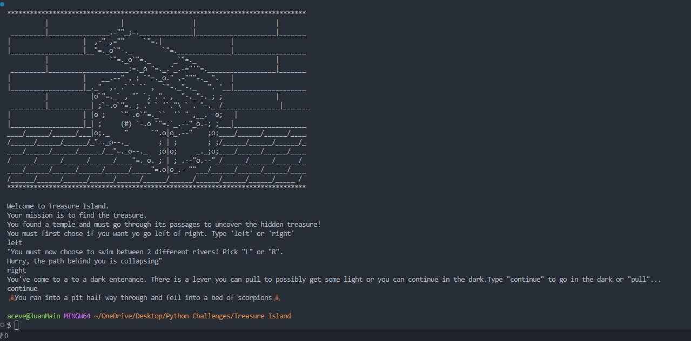

# Treasure-Island-

## Description
The reason for this project was to learn small skills to later help build up towards the final project of creating a mini game that runs on only python! 

## Table of Contents
-[Descriptions](#Descriptions)
-[Installation](#Installation)
-[Usage](#Usage)
-[Credits](#Credits)
-[Tests](#Tests)
-[License](#License)
-[Questions](##Questions)

## Installation
In order to install this project you will have to clone the repository: 
    1. Create a place where you will want to store all this information 
    2. Once there open GitBash
    3. Clone this repository into the file you will have this stored in
            enter following: git@github.com:juanthtgotaway/Treasure-Island-.git
    4. Press enter to create your local clone

## Usage
This is used to help build on base foundational skills to build up my python knowledge.

## Credits

## Tests
N/A
## License
MIT

## Questions
If you have any questions or concerns feel free to reach out via the following:
GitHub:[juanthtgotaway](https://github.com/juanthtgotaway)